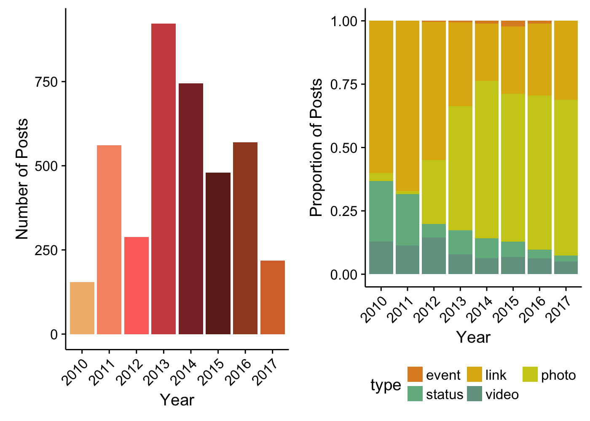
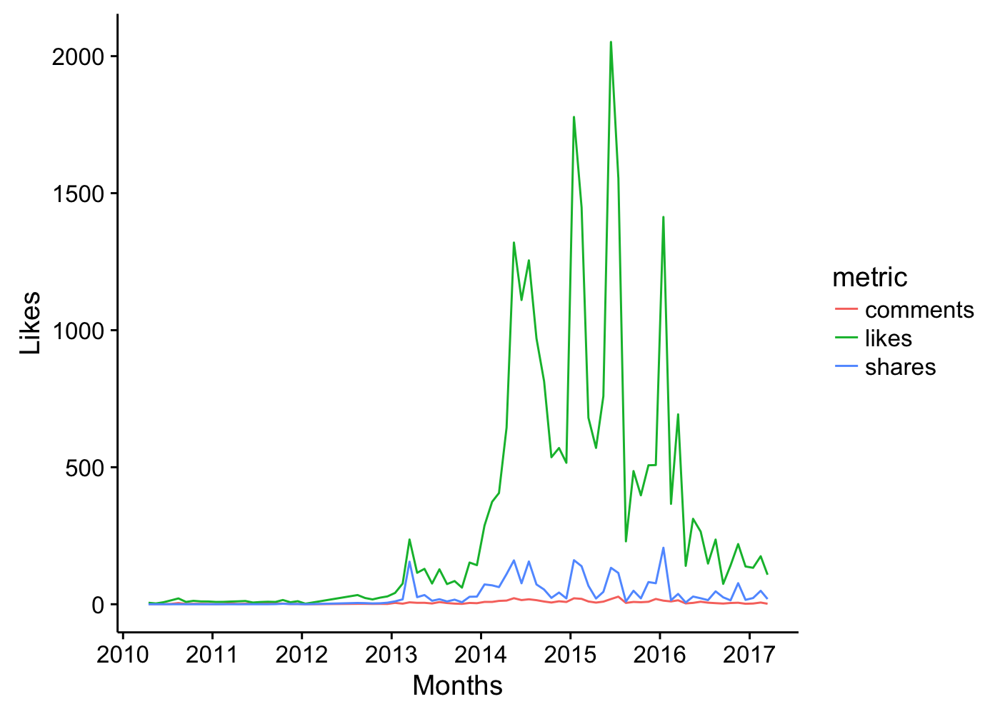
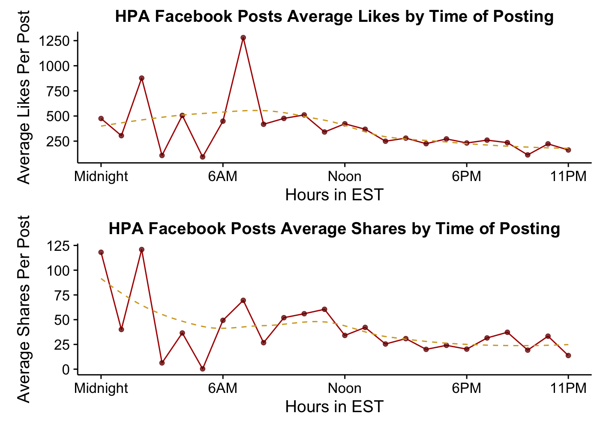
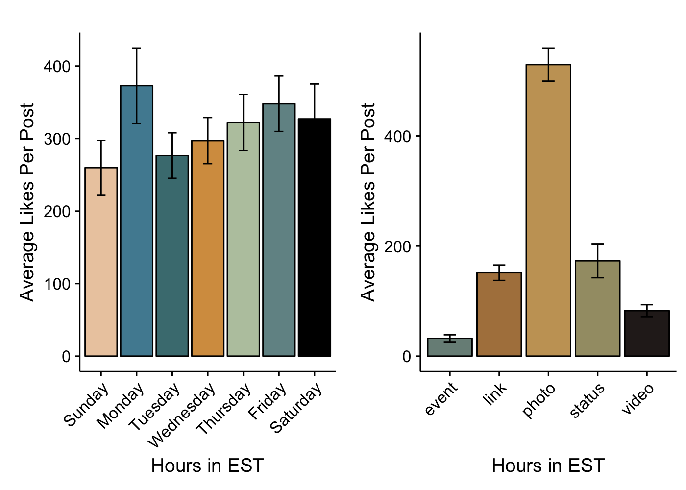
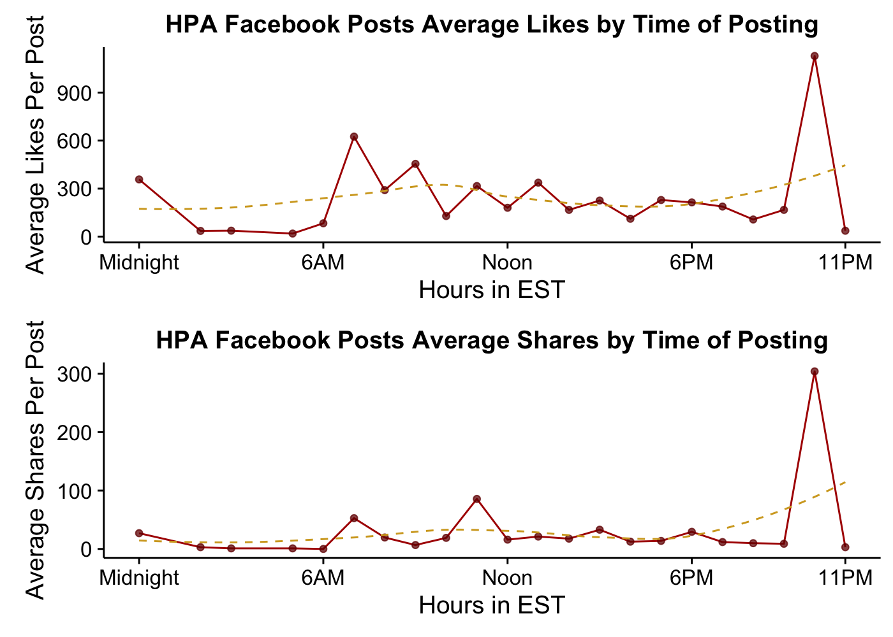
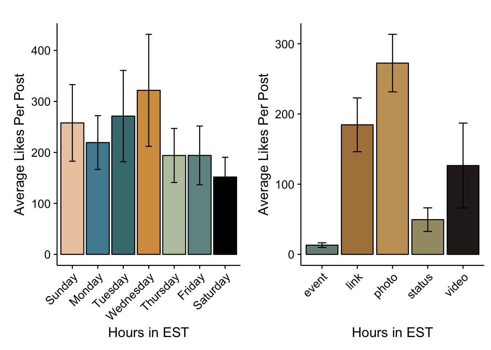
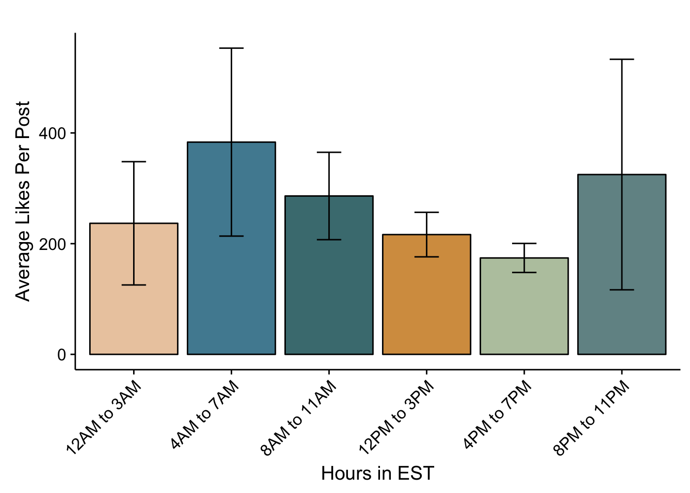

Facebook Report
===============

Hello! So, this report is looking at the lifespan of The Harry Potter Alliance's Facebook page. Overall, this report begins its journey April 8th, 2010, and goes until March 22nd, 2017. We have a total of 3,939 posts in this timeframe.

The first image below shows that we have been less active in recent years compared to 2014/2015. This is a big problem we need to control for - years when we would get 1,000s of likes per post may be a significantly different population then years now, where now a good post brings in maybe 100 likes. So, you may want to take the first analysis with a grain of salt.

It might be useful for us to also consider, well, what types of things are we posting? And, well, it's good to see that when we realized that image-based posts were popular, we have been pretty consistent since about 2013 on our distribution of posts.

So, how has our engagement looked? If we look at averages per month, we've definitely dropped off since the good old days. But I think that's okay. 2016 definitely had a strong showing, so we still have a chance to keep people engaged!

But, perhaps more important, are there any benefits to posting at certain times of the day? Well, if we measure this in terms of "Likes", then the answer is not really. The only statistically significant effect (p&lt;.004) is a bonus at posting at 7 in the morning EST (On average, 805 more likes) - quite a lot! We also see some trending effects, and a significant effect (p&lt;.014) where posting at 10pm EST causes us about a 362 like drop, compared to posting at midnight. Shares we see a slightly different trend, where we have a lot of significant results, but all it shows is that posts around midnight get shared the most.

So, what about days? Well, really, there isn't any large significant differences here either. There's a trending effect that Monday is outpreforming our base group (Sunday), p&lt;.06; Beta=113.07), but otherwise, it's pretty even. And, of course, it's nice to see that indeed, pictures are a good use of our time! People significantly like posts with pictures (p&lt;.003, beta=497.31) more than they like other types of postings.

Facebook Report - Just 2016
===============
So, maybe we should recognize the difference in popularity in the HPA. There's definitely a different population of people that engage compared to the past. So, what if we just look at 2016. Do we see differences from above?

For one, I removed the two posts that dealt with the deaths of Alan Rickman and David Bowie, as they were huge outliers in the data of 2016. (But, good to know, deaths do seem to really bring out our fans... sad.)

So, in general, we do, but it's not something we can really learn from. The large standard errors just mean that we probably had a couple of posts that went pretty big and a lot of posts that were pretty average. So, it's relatively meaningless for what day to post. Time wise, there is a trending effect for a bonus at posting at 11pm, but I can't be sure it's just not another outlier or two.

What is interesting, if there's anything to gain from here, is that links did pretty good in 2016! Photos are still outpreforming them, but it doesn't seem as necessary to post a photo as long as you have a link. Which makes sense, as Facebook auto-generates a photo from a posted link, doesn't it?

